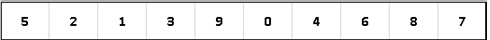
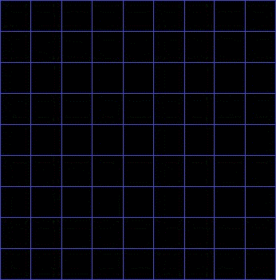

## Общая информация
- [Сравнительная таблица сложности алгоритмов](https://www.bigocheatsheet.com/)  
- [Жадный алгоритм](https://ru.wikipedia.org/wiki/%D0%96%D0%B0%D0%B4%D0%BD%D1%8B%D0%B9_%D0%B0%D0%BB%D0%B3%D0%BE%D1%80%D0%B8%D1%82%D0%BC)
## Базовые алгоритмы 
### Поиск и обход
#### Бинарный поиск
##### Описание
Алгоритм поиска элемента в отсортированном массиве (векторе), использующий дробление массива на половины.
Используется в информатике, вычислительной математике и математическом программировании.

Частным случаем двоичного поиска является метод бисекции, который применяется для поиска корней заданной непрерывной
функции на заданном отрезке.

##### Реализация
1. Определение значения элемента в середине структуры данных. Полученное значение сравнивается с ключом.
2. Если ключ меньше значения середины, то поиск осуществляется в первой половине элементов, иначе — во второй.
3. Поиск сводится к тому, что вновь определяется значение серединного элемента в выбранной половине и сравнивается с
   ключом.
4. Процесс продолжается до тех пор, пока не будет найден элемент со значением ключа или не станет пустым интервал для
   поиска.
##### Пример

###### [Golang](golang-examples/binary-search/main.go)

#### Скользящее окно
##### Описание
Шаблон скользящего окна используется для выполнения операции с определённым размером окна данного массива или 
связанного списка, например для поиска самого длинного подмассива, содержащего все 1. Скользящие окна начинаются с 
1-го элемента, продолжают смещаться вправо на один элемент и регулируют длину окна в соответствии с задачей, 
которую вы решаете. В некоторых случаях размер окна остаётся постоянным, а в других — увеличивается или уменьшается.  

Как определить, когда использовать шаблон скользящего окна:
- входные данные задачи — это линейная структура данных, например связанный список, массив или строка;
- нужно найти самую длинную/короткую подстроку, подмассив или желаемое значение.

Задачи, для которых подойдёт шаблон скользящего окна:
- максимальная сумма подмассива размера «K» (лёгкий);
- самая длинная подстрока с различными «K» символами (средний);
- анаграммы строки (сложный).
##### Пример

###### [Golang](golang-examples/sliding-window/main.go)

#### Два Указателя/Итератора
##### Описание
Это шаблон, в котором два указателя перебирают структуру данных в тандеме, пока один или оба указателя не достигнут 
определённого условия. Два указателя часто полезны при поиске пар в отсортированном массиве или связанном списке. 
Например, когда нужно сравнить каждый элемент массива с другими его элементами.

С одним указателем пришлось бы постоянно возвращаться назад через массив, чтобы найти ответ. Так же, как и с одним 
итератором, это неэффективно для временной и пространственной сложности — концепции, называемой асимптотическим 
анализом. Хотя решение в лоб с одним указателем будет работать, его сложность — около O (n²). Во многих случаях 
два указателя помогут найти решение с лучшей временной и пространственной сложностью.

Как определить, что подойдёт шаблон двух указателей:
- вы имеете дело с отсортированными массивами (или связанными списками), и вам необходимо найти набор элементов, которые 
удовлетворяют определённым ограничениям;
- набор элементов в массиве представляет собой пару, триплет или даже подмассив.

Задачи, для которых подойдёт шаблон двух указателей:
- возведение в квадрат отсортированного массива (лёгкий);
- триплеты, суммирующие до нуля (средний);
- сравнение строк, содержащих пробелы (средний).
##### Пример

###### [Golang](golang-examples/two-pointers/main.go)

#### Быстрые и медленные Указатели/Итераторы
##### Описание
Подход быстрого и медленного указателя, также известный как алгоритм зайца и черепахи, использует два указателя, 
которые перемещаются по массиву (или последовательности / связному списку) с разными скоростями. Этот подход 
полезен при работе с циклически связанными списками или массивами.

Двигаясь с разными скоростями (скажем, в циклически связанном списке), алгоритм доказывает, что эти два указателя 
обязательно встретятся. Быстрый указатель должен перехватывать медленный, когда оба указателя находятся в цикле.

Как определить, когда использовать шаблон быстрого и медленного указателя:
- задача касается цикла в связанном списке или массиве;
- нужно узнать положение определённого элемента или общую длину связанного списка.
- 
Когда использовать его вместо двух указателей?
- В некоторых случаях не следует использовать шаблон Двух указателей, например в одном списке, где вы не можете 
- двигаться в обратном направлении. Использовать этот шаблон нужно, когда вы пытаетесь определить, является ли 
- связанный список палиндромом.

Задачи, для которых подойдёт шаблон быстрого и медленного указателей:
- цикл связанного списка (лёгкий);
- является ли связанный список палиндромом (средний);
- цикл в круговом массиве (сложный).

##### Пример

###### [Golang](golang-examples/fast-slow-pointers/main.go)

#### Поиск в ширину
BSF
##### Описание
Один из простейших алгоритмов обхода графа, являющийся основой для многих важных алгоритмов для работы с графами
##### Реализация
Алгоритм должен пройти по каждому уровню дерева углубляясь ниже только когда на текущем уровне закончаться узлыиаы
##### Пример

###### [Golang](golang-examples/bfs/main.go)

#### Поиск в глубину
DFS
##### Описание
Стратегия поиска в глубину, как и следует из названия, состоит в том, чтобы идти «вглубь» графа, насколько это возможно.
##### Реализация
Алгоритм поиска описывается рекурсивно: перебираем все исходящие из рассматриваемой вершины рёбра. Если ребро ведёт в
вершину, которая не была рассмотрена ранее, то запускаем алгоритм от этой нерассмотренной вершины, а после возвращаемся
и продолжаем перебирать рёбра. Возврат происходит в том случае, если в рассматриваемой вершине не осталось рёбер,
которые ведут в нерассмотренную вершину. Если после завершения алгоритма не все вершины были рассмотрены, то необходимо
запустить алгоритм от одной из нерассмотренных вершин
##### Пример

###### [Golang](golang-examples/dfs/main.go)

#### Слияние интервалов
##### Описание
Эффективный метод работы с пересекающимися интервалами. В большинстве задач, связанных с интервалами, нужно либо найти 
пересекающиеся интервалы, либо совместить интервалы, если они пересекаются. Шаблон работает так:

Для двух интервалов («a» и «b»), есть два способа, которыми эти интервалы могут быть связаны друг с другом.

Понимание этих шести случаев позволит решить широкий спектр задач — от вставки интервалов до оптимизации слияний 
интервалов.

Как определить, что подойдёт шаблон слияния интервалов?
- нужно составить список только с взаимоисключающими интервалами;
- вы слышите термин «пересекающиеся интервалы».

Задачи, для которых подойдёт шаблон слияния интервалов:
- пересечение интервалов (средний);
- максимальная нагрузка на процессор (сложный).

##### Пример

###### [Golang](golang-examples/merge-intervals/main.go)

### Сортировка
#### Сортировки пузырьком
##### Описание
Этот алгоритм — простейший, но эффективен он лишь для небольших массивов. Сложность алгоритма: O(n^2)

Алгоритм считается учебным и практически не применяется вне учебной литературы, вместо него на практике применяются
более эффективные алгоритмы сортировки. В то же время метод сортировки обменами лежит в основе некоторых более
совершенных алгоритмов, таких как шейкерная сортировка, пирамидальная сортировка и быстрая сортировка.

Как частный пример существует в виде "шейкерной сортировки", когда после того, как масимальный элемент выдавлен на край
массива, указатели начинают идти в обратную сторону.
##### Реализация
Алгоритм состоит в повторяющихся проходах по сортируемому массиву. На каждой итерации последовательно сравниваются
соседние элементы, и, если порядок в паре неверный, то элементы меняют местами. За каждый проход по массиву как минимум
один элемент встает на свое место, поэтому необходимо совершить не более n−1
проходов, где n размер массива, чтобы отсортировать массив.
##### Пример

###### [Golang](golang-examples/bubble-sort/main.go)

#### Сортировка выбором
##### Описание
Алгоритм сортировки со сложностью O(n^2), где n — количество элементов для сортировки.
##### Реализация
На каждом i-ом шаге алгоритма находим i-ый минимальный элемент и меняем его местами
с i-ым элементом в массиве. Таким образом будет получен массив, отсортированный по возрастанию.
##### Пример

###### [Golang](golang-examples/selection-sort/main.go)

#### Сортировка вставками
##### Описание
Элементы входной последовательности просматриваются по одному, и каждый новый поступивший элемент размещается в
подходящее место среди ранее упорядоченных элементов. Сложность O(n^2).
Есть несколько вариантов оптимизаций: бинарная и двухпутевые
##### Реализация
Каждый элемент в линейном обходе массива перемещается в отсортированную часть, где занимает место согласно своим весам.
##### Пример

###### [Golang](golang-examples/insert-sort/main.go)

#### Быстрая сортировка
##### Описание
Основывается на принципе "разделяй и властвуй". Он работает путем выбора элемента из массива, называемого опорным
элементом, и перемещения всех элементов, которые меньше опорного элемента, влево от него, а все элементы, которые
больше опорного элемента, перемещаются вправо. Затем процесс повторяется рекурсивно для каждой из двух полученных
половинок массива.
Сложность O(n log n).  
В худшем случае O(n^2)
##### Реализация
Алгоритм быстрой сортировки начинается с проверки длины массива. Если массив содержит менее двух элементов, то он уже
отсортирован, и функция возвращает его как есть.  
Затем выбирается опорный элемент путем выбора случайного индекса в массиве. Он перемещается в конец массива, и
происходит разделение массива на две части: элементы, которые меньше опорного, и элементы, которые больше опорного.  
Элементы, которые меньше опорного, перемещаются в левую часть массива, а элементы, которые больше опорного, перемещаются
в правую часть массива. Затем процесс повторяется рекурсивно для каждой из двух полученных половинок массива.  
Когда размер каждой половины массива становится меньше двух, функция возвращает отсортированный массив.
##### Пример

###### [Golang](golang-examples/quick-sort/main.go)

#### Сортировка слиянием
##### Описание
Алгоритм сортировки, использующий O(n) дополнительной памяти и работающий за O(nlog(n)) времени.
##### Реализация
1. Если в рассматриваемом массиве один элемент, то он уже отсортирован — алгоритм завершает работу.
2. Иначе массив разбивается на две части, которые сортируются рекурсивно.
3. После сортировки двух частей массива к ним применяется процедура слияния, которая по двум отсортированным частям
   получает исходный отсортированный массив.
##### Пример

###### [Golang](golang-examples/merge-sort/main.go)

#### Топологическая сортировка
##### Описание
Упорядочивание вершин бесконтурного ориентированного графа согласно частичному порядку, заданному ребрами орграфа на 
множестве его вершин
##### Пример

###### [Golang](golang-examples/topological-sort/main.go)

#### Сортировка подсчётом
##### Описание
Алгоритм сортировки, в котором используется диапазон чисел сортируемого массива (списка) для подсчёта совпадающих 
элементов. Применение сортировки подсчётом целесообразно лишь тогда, когда сортируемые числа имеют (или их можно 
отобразить в) диапазон возможных значений, который достаточно мал по сравнению с сортируемым множеством, например, 
миллион натуральных чисел меньших 1000.
##### Пример
 
###### [Golang](golang-examples/count-sort/main.go)

#### Циклическая сортировка
##### Описание
Интересный подход для решения задач, которые связаны с массивами, содержащими числа в заданном диапазоне. 
Шаблон циклической сортировки выполняет итерацию по массиву по одному числу за раз, и если текущее число, 
которое вы перебираете, не соответствует правильному индексу, вы меняете его местами с числом по правильному 
индексу. Можете попытаться поместить число, с которым мы поменяли текущее число, в правильный индекс, но это 
приведет к сложности O (n²), поэтому больше подойдёт метод циклической сортировки.

Как определить, когда использовать шаблон циклической сортировки:
- в задачах с использованием отсортированного массива с числами в заданном диапазоне;
- если нужно найти отсутствующее/дублированное/наименьшее число в отсортированном/повёрнутом массиве.

Задачи, для которых подойдёт шаблон циклической сортировки:
- найти недостающий номер (лёгкий);
- найти наименьшее недостающее положительное число (средний).
##### Пример

## Продвинутые алгоритмы
### Поиск и обход
#### Топ К элементов
##### Описание
Любая задача, в которой требуется найти самые большие / самые маленькие / частые K-элементы среди данного набора, п
одпадает под этот шаблон.

Лучшая структура данных для отслеживания K-элементов — куча. Этот шаблон будет использовать кучу для решения задач, 
связанных с K-элементами одновременно из набора заданных элементов. Шаблон выглядит так:
- Вставьте K-элементы в Min-heap или Max-heap в зависимости от задачи.
- Выполните итерации по оставшимся числам и, если найдёте число, которое больше, чем у вас в куче, удалите это число 
и вставьте большее.

Нет необходимости в алгоритме сортировки, потому что куча будет отслеживать элементы для вас.

Как определить, когда использовать шаблон Топ К-элементов:
- если нужно найти самые большие / самые маленькие / частые K-элементы в данном наборе;
- если нужно отсортировать массив, чтобы найти верный элемент.

Задачи, для которых подойдёт шаблон Топ К-элементов:
- топ K-номеров (лёгкий);
- топ K-частых номеров (средний).
##### Пример

###### [Golang](golang-examples/top-k/main.go)

#### K way слияние
##### Описание
K-way слияние поможет решить задачи, связанные с набором отсортированных массивов.

Когда вам дают отсортированные K-массивы, вы можете использовать кучу для эффективного выполнения отсортированного 
обхода всех элементов всех массивов. Можете поместить наименьший элемент каждого массива в Min Heap, чтобы получить 
общий минимум. После этого поместите следующий элемент из того же массива в кучу. Затем повторите, чтобы сделать 
отсортированный обход всех элементов.

Шаблон выглядит так:
- Вставьте первый элемент каждого массива в Min Heap.
- Извлеките самый маленький (большой) элемент из кучи и добавьте в объединённый список.
- После удаления наименьшего элемента из кучи вставьте следующий элемент из того же списка в кучу.
- Повторите шаги 2 и 3, чтобы заполнить объединённый список в отсортированном порядке.

Как определить, когда использовать шаблон K-Way слияние:
- задача состоит из отсортированных массивов, списков или матрицы;
- требуется объединить отсортированные списки или найти самый маленький элемент в отсортированном списке.

Задачи, для которых подойдёт шаблон K-Way слияние:
- слияние K-сортированных списков (средний);
- K-пары с самыми большими суммами (сложный).
##### Пример

###### [Golang](golang-examples/k-way/main.go)

#### Кодирование Хаффмена
##### Описание
Алгоритм оптимального префиксного кодирования алфавита. Был разработан в 1952 году аспирантом Массачусетского
технологического института Дэвидом Хаффманом при написании им курсовой работы. Используется во многих программах
сжатия данных, например, PKZIP 2, LZH и др
##### Реализация
1. Составим список кодируемых символов, при этом будем рассматривать один символ как дерево, состоящее из одного элемента
   c весом, равным частоте появления символа в строке.
2. Из списка выберем два узла с наименьшим весом.
3. Сформируем новый узел с весом, равным сумме весов выбранных узлов, и присоединим к нему два выбранных узла в качестве детей.
4. Добавим к списку только что сформированный узел вместо двух объединенных узлов.
5. Если в списке больше одного узла, то повторим пункты со второго по пятый.
##### Пример

##### [Golang](golang-examples/huffman/main.go)

#### Градиентный спуск
##### Описание
Способ оптимизации функций, основанный на вычислениях. В контексте машинного обучения или регрессии это значит
нахождение значений весов алгоритма ML, минимизирующих ошибку в предсказаниях. И хотя математически он более сложен,
чем остальные алгоритмы, при работе с данными и предсказаниями понимание его работы имеет огромное значение.
##### Реализация
Необходимо создать функцию и её производную.  
Определяем функцию, которая будет выполнять градиентный спуск на указанное количество итераций с заданным шагом.  
Более подробно о спуске лучше почитать в статьях о машинном обучении.
##### Пример

###### [Golang](golang-examples/gradient/main.go)

#### Алгоритм Дейкстры
##### Описание
Способ поиска кратчайшего пути между узлами в графе. Он является базой в задачах поиска пути и находит широкое
применение начиная с искусственного интеллекта и заканчивая созданием игр.
##### Приме

###### [Golang](golang-examples/dijkstra/main.go)

#### Обмен ключами Диффи Хеллмана
##### Описание
Он работает путем объединения открытых и закрытых ключей (которые представляют из себя очень длинные числа) для
шифрования информации, передаваемой между двумя различными сторонами.
##### Пример

###### [Golang](golang-examples/diffie-hellman/main.go)

#### Quickselect
##### Описание
Алгоритм выбора для поиска k'th наименьший элемент в неупорядоченном списке. Он тесно связан с Алгоритм быстрой 
сортировки. Как и Quicksort, он традиционно эффективен и обеспечивает хорошую производительность в среднем случае, 
но плохую производительность в худшем случае. Сложность O(n)
##### Пример

###### [Golang](golang-examples/quick-select/main.go)

#### Алгоритм Беллмана Форда
##### Описание
Позволяет найти кратчайшие пути из одной вершины графа до всех остальных, даже для графов, в которых веса ребер 
могут быть отрицательными. Тем не менее, в графе не должно быть циклов отрицательного веса, достижимых из начальной 
вершины, иначе вопрос о кратчайших путях является бессмысленным. При этом алгоритм Форда-Беллмана позволяет определить
наличие циклов отрицательного веса, достижимых из начальной вершины.
##### Пример

###### [Golang](golang-examples/bellman-ford/main.go)

#### А звезда
##### Описание
в информатике и математике, алгоритм поиска по первому наилучшему совпадению на графе, который находит маршрут с 
наименьшей стоимостью от одной вершины (начальной) к другой (целевой, конечной).

Порядок обхода вершин определяется эвристической функцией «расстояние + стоимость» (обычно обозначаемой как f(x)). 
Эта функция — сумма двух других: функции стоимости достижения рассматриваемой вершины (x) из начальной (обычно 
обозначается как g(x) и может быть как эвристической, так и нет), и функции эвристической оценки расстояния от
рассматриваемой вершины к конечной (обозначается как h(x)).

A* пошагово просматривает все пути, ведущие от начальной вершины в конечную, пока не найдёт минимальный. 
Как и все информированные алгоритмы поиска, он просматривает сначала те маршруты, которые «кажутся» ведущими к 
цели. От жадного алгоритма, который тоже является алгоритмом поиска по первому лучшему совпадению, его отличает то, 
что при выборе вершины он учитывает, помимо прочего, весь пройденный до неё путь. Составляющая g(x) — это стоимость 
пути от начальной вершины, а не от предыдущей, как в жадном алгоритме.
##### Пример

#### Двоичная куча
##### Описание
о многих задачах дан набор элементов, которые можно разделить на две части. Чтобы решить задачу, нужно знать наименьший 
элемент в одной части и наибольший в другой.

Сложность O(log n)

Этот шаблон использует две кучи: Min Heap, чтобы найти самый маленький элемент, и Max Heap, чтобы найти самый большой. 
Шаблон работает, сохраняя первую половину чисел в Max Heap, потому что вы ищите наибольшее число в первой половине. 
Затем вы сохраняете вторую половину чисел в Min Heap, так как хотите найти наименьшее число во второй половине. 
В любой момент медиана текущего списка чисел может быть вычислена из верхнего элемента двух куч.

Как определить, когда использовать шаблон две кучи:
- приоритетные очереди, планирование;
- нужно найти самые маленькие / самые большие / медианные элементы набора;
- иногда полезен в задачах с бинарной структурой данных.

Задачи, для которых подойдёт шаблон две кучи:
- найти медиану потока чисел (средний).
##### Пример

###### [Golang](golang-examples/binary-heap/main.go)

